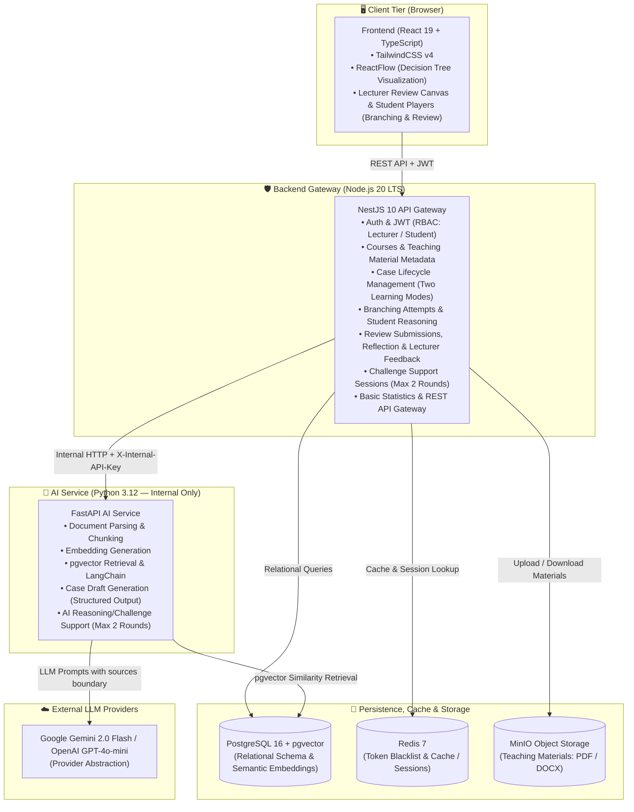

<p align="center">
  <h1 align="center">🎓 CaseTree AI</h1>
  <p align="center">
    <strong>AI Platform for Interactive Branching Case Studies and Open Review in University Teaching</strong>
  </p>
  <p align="center">
    AI Case Generator · Branching Decision Tree Simulator · Debate Assistant · Lecturer Review Workflow
  </p>
</p>

<p align="center">
  
  
  
  
  
  
  
  
  
  
</p>

<p align="center">
  <a href="#-overview">Overview</a> ·
  <a href="#-current-status-structural-skeleton-only">Project Status</a> ·
  <a href="#️-architecture">Architecture</a> ·
  <a href="#-tech-stack">Tech Stack</a> ·
  <a href="#-repository-structure">Repository</a> ·
  <a href="#-local-development">Local Dev</a> ·
  <a href="#-git-safety--secret-protection">Git Safety</a> ·
  <a href="#-testing--verification">Testing</a> ·
  <a href="#-git-workflow">Git Workflow</a>
</p>

---

## 📖 Overview

**CaseTree AI** is a university-focused AI platform that empowers lecturers to generate and facilitate interactive case studies directly from their syllabus materials (PDF / DOCX). It supports two distinct learning modes defined in Proposal V1.1:

1. **Branching Study**: Students navigate interactive decision-tree dilemma scenarios, articulate written reasoning per attempt, view lecturer-authored consequences, reach an outcome, reflect, and optionally retry the scenario to explore alternative paths.
2. **Review Study**: Students receive real-world case context, data, and an open problem, analyze it, propose a solution with reasoning, receive qualitative lecturer review and feedback, and engage in reflection.

The platform includes embedded **AI Reasoning & Challenge Support** (1–2 rounds maximum, counter-questions only, strictly no grading or scoring). Every case follows the mandatory Human-in-the-Loop gate: `DRAFT → REVIEWED → APPROVED → PUBLISHED`.

---

## ⚠️ Current Status: STRUCTURAL SKELETON ONLY

> **IMPORTANT NOTICE FOR CONTRIBUTORS AND AUDITORS:**
> 
> The CaseTree AI repository is currently in the **STRUCTURAL SKELETON ONLY** phase.
> - ✅ Project structure, module boundaries, routing layouts, and configurations are established.
> - ✅ Database schemas (V1 Base + V2 New Flow Migration), indexes, vector extensions, and enums are defined.
> - ✅ Pydantic schemas, TypeScript interfaces, DTO declarations, and health check endpoints (`/health`) are active.
> - ❌ **NO business logic has been implemented yet.** Feature implementations will be developed incrementally across sprint feature branches.

---

## 🎓 Core Workflows

### Common Flow (Case Creation to Publication)
```
Teaching Material (PDF / DOCX)
            ↓
AI Service + RAG generates Case Draft (learning_mode = BRANCHING_STUDY or REVIEW_STUDY)
            ↓
Lecturer inspects, edits, and refines case (DRAFT → REVIEWED)
            ↓
Lecturer approves the case (APPROVED)
            ↓
Lecturer publishes the case (PUBLISHED — accessible to students)
```

### Branching Study Flow
```
Context & Data → Decision Point → Select Option → Student Reasoning per Attempt
            ↓
Lecturer-authored Consequence revealed
            ↓
[Optional: AI Challenge Support, max 2 rounds, counter-questions only]
            ↓
Next Node → ... → Terminal Outcome reached
            ↓
Student Reflection submitted → [Optional: Retry creates New Attempt]
```

### Review Study Flow
```
Context & Data → Problem / Question Statement
            ↓
Student Analysis (optional) → Proposed Solution & Reasoning submitted
            ↓
[Optional: AI Challenge Support, max 2 rounds, counter-questions only]
            ↓
Submission Status: SUBMITTED
            ↓
Lecturer Reviews submission & provides Feedback → Status: REVIEWED
            ↓
Student Reflection on Feedback submitted → Status: REFLECTED
```

---

## 🏗️ Architecture

The system strictly enforces a three-tier architecture:
- **Client (Frontend)**: React 19 SPA running in the browser.
- **Backend Gateway**: Node.js 20 LTS + NestJS 10 acting as the single public REST API entry point.
- **AI Service**: Python 3.12 + FastAPI operating strictly as an **internal** microservice on the private container network.

### System Architecture Diagram



### Architectural Principles

1. **Frontend → Backend Gateway Only**: The React client communicates exclusively with the NestJS gateway. The AI Service is completely hidden from the browser.
2. **AI Service is Internal**: FastAPI requires the `X-Internal-API-Key` header and does not expose Swagger documentation or endpoints to the public internet.
3. **Untrusted Data Boundary**: Teaching materials and RAG chunks are treated as untrusted data. Content passed to the LLM must be wrapped in `<sources>...</sources>` to prevent prompt injection.
4. **Mandatory Human-in-the-Loop**: Cases automatically generate in `DRAFT` status. Students can never view or simulate unapproved cases (`PUBLISHED` status enforced at the query level).
5. **AI Challenge Support Does Not Grade**: AI Challenge Support provides Socratic counter-questions capped at 2 rounds. It does not grade, assign scores, or evaluate pass/fail criteria.

---

## 🛠 Tech Stack

| Layer | Technology | Details / Purpose |
| :--- | :--- | :--- |
| **Frontend** | React 19, TypeScript 5.x, Vite | Client SPA |
| **Styling** | TailwindCSS v4 | Utility-first clean typography & layout |
| **Tree Visualizer** | ReactFlow 11.x | Interactive node-based decision tree canvas |
| **State Management**| Zustand | Lightweight client stores (Auth, UI state) |
| **HTTP Client** | Axios | Centralized client with JWT auth interceptors |
| **Backend Gateway** | Node.js 20 LTS, NestJS 10, TypeScript | REST API Gateway, Auth, RBAC, Business State |
| **AI / RAG Service** | Python 3.12, FastAPI, LangChain | Internal AI microservice, document chunking, RAG |
| **LLM Providers** | Gemini 2.0 Flash / OpenAI GPT-4o-mini | Unified via Provider Abstraction (`providers/factory.py`) |
| **Relational & Vector**| PostgreSQL 16 + pgvector | Relational entities & 1536/768-dim embeddings |
| **Cache & Sessions** | Redis 7 | Revocation blacklist, transient session cache |
| **Object Storage** | MinIO (S3 Compatible) | PDF / DOCX teaching syllabus uploads |
| **Infrastructure** | Docker, Docker Compose | Multi-container local development stack |
| **Database Migrations**| Flyway / SQL Migrations | Versioned DDL scripts (`V1__init_schema.sql`, `V2__new_flow_schema.sql`) |

---

## 📁 Repository Structure

```
CaseTree-AI/
├── backend/                         ← NestJS 10 Backend Gateway (Node.js 20)
│   ├── src/
│   │   ├── app.module.ts            ← Main application module
│   │   ├── main.ts                  ← Bootstrap entry point (Port 8080, /api/v1)
│   │   ├── common/                  ← Health checks, guards, interceptors
│   │   └── modules/                 ← Domain feature modules (Skeleton)
│   │       ├── auth/                ← JWT authentication & login/register
│   │       ├── user/                ← User entities & role management
│   │       ├── course/              ← Course metadata & ownership
│   │       ├── material/            ← Teaching material files
│   │       ├── case/                ← Case lifecycle & decision tree graphs
│   │       ├── branching-attempt/   ← Branching Study student attempts & navigation
│   │       ├── reasoning/           ← Student reasoning per attempt
│   │       ├── challenge-support/   ← AI Reasoning/Challenge Support session state
│   │       ├── review-study/        ← Review Study submissions & workflow
│   │       ├── lecturer-feedback/   ← Lecturer Review/Feedback on student work
│   │       ├── statistics/          ← Basic learning-flow statistics
│   │       ├── notification/        ← Notification extension point
│   │       └── evaluation/          ← Research rubric & export boundary
│   └── package.json
│
├── ai-service/                      ← FastAPI AI Service (Python 3.12 — Internal)
│   ├── app/
│   │   ├── main.py                  ← FastAPI entry point (/health endpoint)
│   │   ├── core/                    ← Settings, security, logging, exceptions
│   │   ├── providers/               ← Provider abstraction (Gemini / OpenAI)
│   │   ├── ingestion/               ← Document parser (PDF/DOCX) & chunker
│   │   ├── retrieval/               ← pgvector similarity search & LangChain
│   │   ├── generation/              ← Structured decision tree generation schemas
│   │   ├── challenge_support/       ← AI challenge support schemas & 2-round cap
│   │   └── evaluation/              ← Research evaluation helper stubs
│   ├── requirements.txt
│   └── .env.example
│
├── frontend/                        ← React 19 + TypeScript + Vite Client
│   ├── src/
│   │   ├── app/router.tsx           ← React Router configuration
│   │   ├── components/              ← UI primitives & decision tree components
│   │   ├── layouts/                 ← PublicLayout, LecturerLayout, StudentLayout
│   │   ├── pages/                   ← Route view shells (Lecturer / Student)
│   │   ├── services/apiClient.ts    ← Centralized Axios API client
│   │   ├── stores/authStore.ts      ← Zustand authentication state
│   │   └── types/index.ts           ← Shared domain TypeScript declarations
│   └── package.json
│
├── infrastructure/                  ← Docker & Database Infrastructure
│   ├── docker/                      ← Dockerfiles for backend, ai-service, frontend
│   ├── minio/                       ← MinIO bucket initialization scripts
│   └── postgres/
│       ├── init/                    ← Initial pgvector & database setup
│       └── migrations/              ← V1__init_schema.sql, V2__new_flow_schema.sql
│
├── docs/                            ← Authoritative Project Documentation
│   ├── architecture/                ← ADRs, system architecture, data flow
│   ├── requirements/                ← Proposal traceability matrix
│   ├── features/                    ← Feature specifications (both learning modes)
│   └── ai/                          ← RAG & Challenge Support specifications
│
├── .githooks/                       ← Zero-dependency pre-commit safety hooks
├── scripts/                         ← Infrastructure startup automation scripts
├── .agents/rules/                   ← AI coding agent rules & governance
├── docker-compose.yml               ← Full local infrastructure stack
└── .env.example                     ← Master configuration template
```

---

## 🚀 Local Development

### Prerequisites

| Dependency | Minimum Version | Note |
| :--- | :--- | :--- |
| **Node.js** | 20 LTS (`v20.x`) | For Backend Gateway & Frontend |
| **Python** | 3.12+ | For FastAPI AI Service |
| **Docker & Compose** | Latest | For PostgreSQL, Redis, and MinIO |

### Step 1: Environment Setup

```bash
# 1. Copy the master environment template
cp .env.example .env

# 2. Copy service-specific templates
cp backend/.env.example backend/.env
cp ai-service/.env.example ai-service/.env
cp frontend/.env.example frontend/.env
```

> 🔒 **Security Notice:** Never commit `.env` files or API credentials to Git. Fill in dummy keys for local development or export your own OpenAI/Gemini keys locally.

### Step 2: Start Infrastructure (Postgres, Redis, MinIO)

```bash
# Launch PostgreSQL (5432), Redis (6379), and MinIO (9000/9001)
docker compose up -d

# Verify all containers are healthy
docker compose ps
```

### Step 3: Start Backend Gateway

```bash
cd backend
npm install
npm run build
npm run start:dev
# Backend Gateway runs at: http://localhost:8080
# Health check: GET http://localhost:8080/api/v1/health
```

### Step 4: Start AI Service

```bash
cd ai-service
python -m venv .venv
# Activate virtual environment:
# Linux/macOS: source .venv/bin/activate
# Windows:     .venv\Scripts\activate
pip install -r requirements.txt
uvicorn app.main:app --reload --port 8000
# AI Service runs at: http://localhost:8000 (Internal Only)
# Health check: GET http://localhost:8000/health
```

### Step 5: Start Frontend

```bash
cd frontend
npm install
npm run build
npm run dev
# Frontend runs at: http://localhost:5173
```

---

## 🔒 Git Safety & Secret Protection

CaseTree AI enforces strict repository rules to prevent the accidental leakage of secrets, keys, and environment files.

### 1. Pre-commit Hook Safeguard
A zero-dependency pre-commit hook is provided in `.githooks/pre-commit`. It scans staged files and rejects commits containing:
- `.env`, `.env.*` files
- Private keys (`*.pem`, `*.key`, `*.p12`, `*.pfx`, `id_rsa`)
- Cloud service credentials (`credentials.json`, `service-account*.json`)
- Raw private key blocks in commit diffs

To enable the pre-commit hook locally:
```bash
git config core.hooksPath .githooks
```

### 2. Tracked File Integrity
The root `.gitignore` ignores all local environment files, caches, build artifacts (`dist/`, `build/`, `node_modules/`, `__pycache__/`), and logs, while explicitly preserving all essential project files, configurations, and documentation.

---

## 🧪 Testing & Verification

Each tier includes independent verification commands:

```bash
# Backend Gateway (NestJS)
cd backend && npm run test

# AI Service (FastAPI & Pydantic Schemas)
cd ai-service && pytest

# Frontend (React 19 & Vitest)
cd frontend && npm test
```

---

## 🌳 Git Workflow & Branch Conventions

Development follows a strict **Feature Branch Workflow**:

```
feature/<module>-<name>  →  develop  →  main
fix/<module>-<name>      →  develop
hotfix/<description>     →  main
```

### Branch Naming Standard

| Category | Pattern | Example |
| :--- | :--- | :--- |
| **Feature** | `feature/<module>-<name>` | `feature/rag-document-parser` |
| **Bug Fix** | `fix/<module>-<description>` | `fix/auth-token-refresh` |
| **Hotfix** | `hotfix/<description>` | `hotfix/cors-origin-fix` |
| **Refactor** | `refactor/<module>` | `refactor/tree-bfs-validation` |
| **Docs** | `docs/<topic>` | `docs/system-architecture` |

### Commit Format (Conventional Commits)

```
<type>(<scope>): <short description in present tense>
```
- **Types**: `feat`, `fix`, `docs`, `style`, `refactor`, `test`, `chore`, `ci`
- **Scopes**: `backend`, `ai-service`, `frontend`, `infra`, `docs`, `repo`
- **Example**: `feat(ai-service): add pydantic tree validation schema`

---

## 📄 License & Policies

- **License**: MIT License — see [LICENSE](LICENSE).
- **Contributing**: Contribution standards — see [CONTRIBUTING.md](CONTRIBUTING.md).
- **Security**: Vulnerability reporting & AI governance policy — see [SECURITY.md](SECURITY.md).
