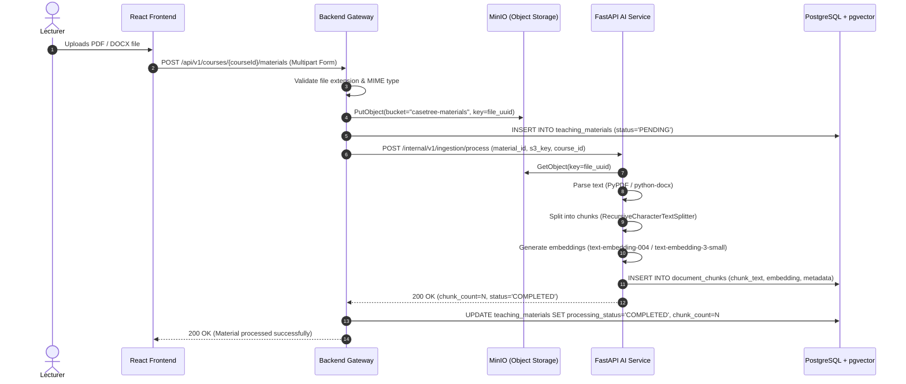
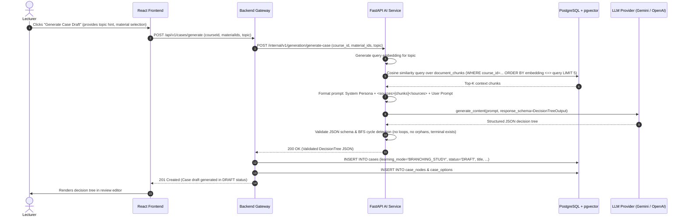
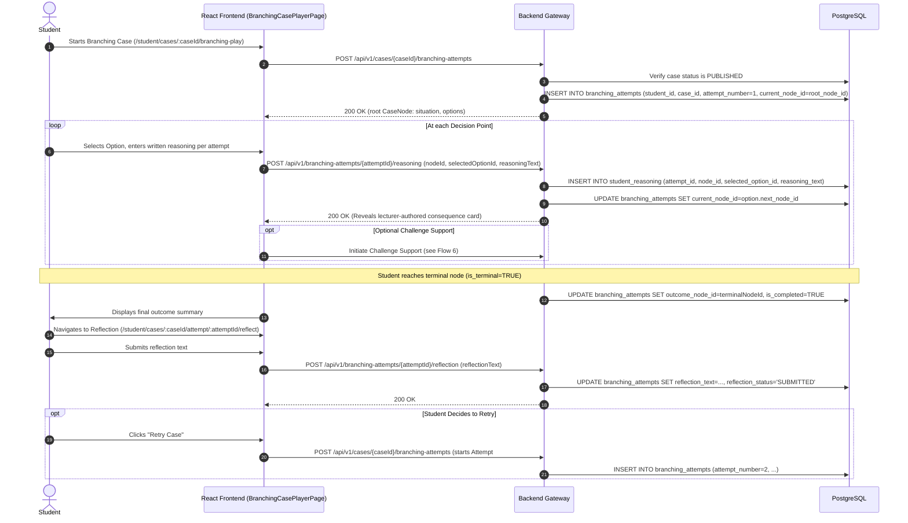
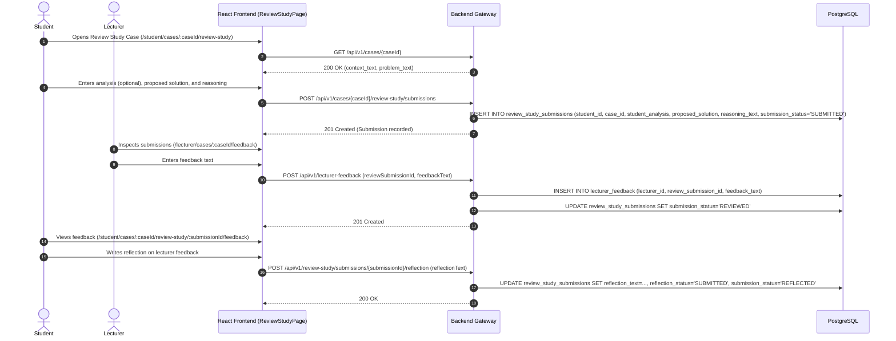
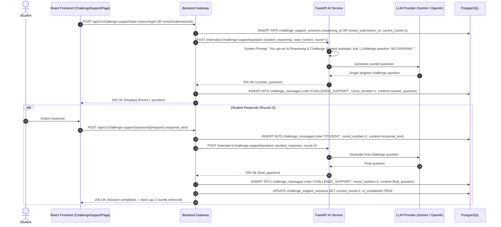
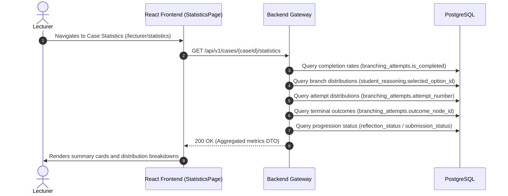

# Edu-Branch-AI — System Data Flows & Sequences

> **Document Status**: Authoritative Architecture Specification  
> **Source of Truth**: Proposal V1.1 (C1SE_65-CaseTree-AI-Proposal_V1_1.docx)  
> **Purpose**: Traces end-to-end data flows and lifecycle sequences across system components for both learning modes (Branching Study & Review Study).

---

## 1. Flow 1: Teaching Material Upload & Document Processing



---

## 2. Flow 2: AI Case Draft Generation (RAG + Structured Output)



---

## 3. Flow 3: Lecturer Review, Edit & Publishing Workflow

```mermaid
sequenceDiagram
    autonumber
    actor Lecturer
    participant FE as React Frontend (ReactFlow)
    participant BE as Backend Gateway
    participant DB as PostgreSQL

    Lecturer->>FE: Reviews case in editor (ReactFlow for Branching; text form for Review Study)
    Lecturer->>FE: Modifies content (nodes/options for Branching; context/problem for Review)
    FE->>BE: PUT /api/v1/cases/{caseId}
    BE->>BE: Validate integrity (tree DAG / non-empty fields)
    BE->>DB: UPDATE cases SET status='REVIEWED' (and update nodes/text)
    BE-->>FE: 200 OK (Updated)
    Lecturer->>FE: Clicks "Approve Case"
    FE->>BE: POST /api/v1/cases/{caseId}/approve
    BE->>DB: UPDATE cases SET status='APPROVED'
    BE-->>FE: 200 OK
    Lecturer->>FE: Clicks "Publish to Students"
    FE->>BE: POST /api/v1/cases/{caseId}/publish
    BE->>BE: Enforce publication invariants (INV-02 / INV-03)
    BE->>DB: UPDATE cases SET status='PUBLISHED'
    BE-->>FE: 200 OK (Case now accessible to students)
```

---

## 4. Flow 4: Branching Study (Player, Attempt, Reasoning, Outcome, Reflection & Retry)



---

## 5. Flow 5: Review Study (Context/Data, Problem, Submission, Feedback & Reflection)



---

## 6. Flow 6: AI Reasoning & Challenge Support (Both Modes)



---

## 7. Flow 7: Basic Learning-Flow Statistics


