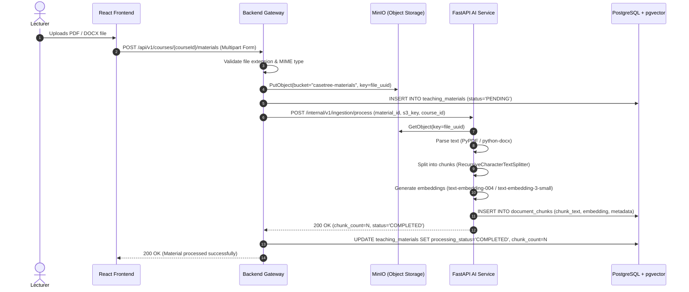
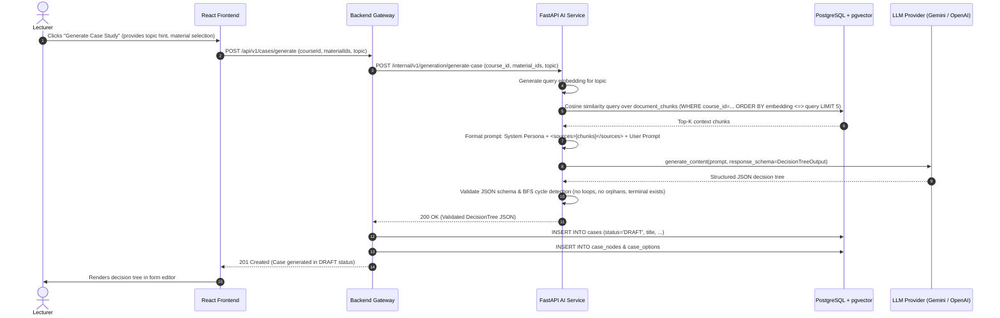
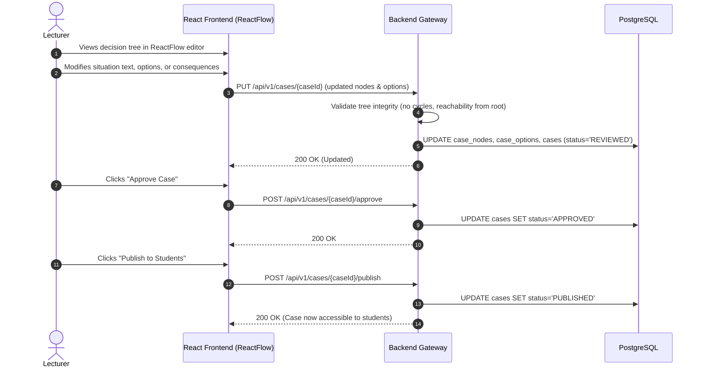
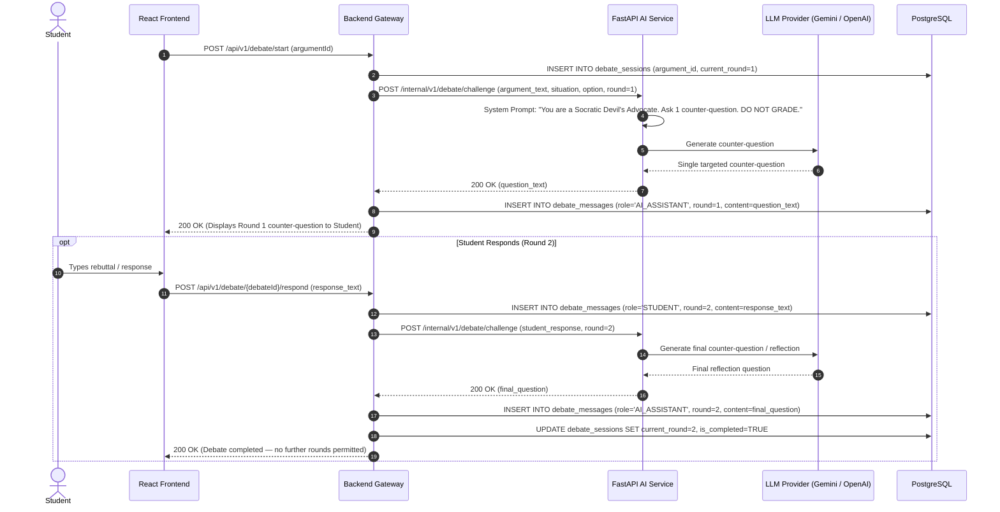
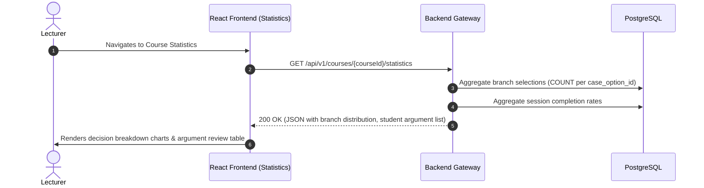

# CaseTree AI — System Data Flows & Sequences

> **Document Status**: Authoritative Architecture Specification  
> **Purpose**: Traces end-to-end data flows and lifecycle sequences across the system components.

---

## 1. Flow 1: Teaching Material Upload & Document Processing



---

## 2. Flow 2: AI Case Generation (RAG + Structured JSON Output)



---

## 3. Flow 3: Lecturer Review, Edit & Publishing Workflow



---

## 4. Flow 4: Student Simulator & Decision Argument Capture

```mermaid
sequenceDiagram
    autonumber
    actor Student
    participant FE as React Frontend (Simulator)
    participant BE as Backend Gateway
    participant DB as PostgreSQL

    Student->>FE: Enters Simulator for published case
    FE->>BE: POST /api/v1/cases/{caseId}/simulation/start
    BE->>DB: Verify case status is PUBLISHED
    BE->>DB: INSERT INTO simulation_sessions (student_id, current_node=root_node_id)
    BE-->>FE: 200 OK (root CaseNode: situation, options)
    Student->>FE: Selects Option B, reads immediate consequence
    Student->>FE: Types short justification argument
    FE->>BE: POST /api/v1/simulation/{sessionId}/decision (nodeId, optionId, argumentText)
    BE->>DB: INSERT INTO student_arguments (argument_text, option_id, node_id)
    BE->>DB: UPDATE simulation_sessions SET current_node_id=option.next_node_id
    BE-->>FE: 200 OK (Saved; triggers Debate Assistant modal)
```

---

## 5. Flow 5: AI Debate Assistant (Devil's Advocate Challenge)



---

## 6. Flow 6: Lecturer Statistics & Research Data Inspection


