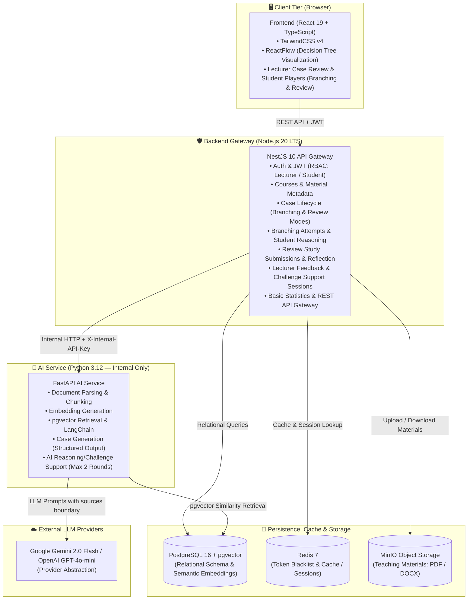

# CaseTree AI — System Architecture

**Status**: Scaffolded

---

## High-Level Architecture

```
┌─────────────────────────────────────────────────────────────────┐
│  Client Tier (Browser)                                          │
│  React 19 + Vite + TypeScript + TailwindCSS v4 + ReactFlow      │
│  • Lecturer: courses, materials, case generation, review, stats │
│  • Student: branching player, review study, reasoning, challenge│
└───────────────────────────────┬─────────────────────────────────┘
                                │ REST API + JWT
                                ▼
┌─────────────────────────────────────────────────────────────────┐
│  Backend Gateway (Node.js NestJS 10 + TypeScript)               │
│  • Auth & Security (JWT)                                        │
│  • Users, Roles (LECTURER, STUDENT)                             │
│  • Courses, Teaching Materials (metadata)                       │
│  • Case Lifecycle (DRAFT→REVIEWED→APPROVED→PUBLISHED)           │
│  • Learning Modes: Branching Study & Review Study               │
│  • Branching Attempts & Student Reasoning                       │
│  • Review Study Submissions & Student Reflection                │
│  • Challenge Support Sessions (Max 2 Rounds, No Grading)        │
│  • Lecturer Feedback & Basic Statistics                         │
│  • Internal HTTP Client → FastAPI                               │
└────────────┬──────────────────┬──────────────────────┬──────────┘
             │ SQL / Schema     │ S3 Client            │ Internal HTTP + API Key
             ▼                  ▼                      ▼
┌──────────────────┐  ┌──────────────────┐  ┌─────────────────────────────────┐
│  PostgreSQL 16   │  │  MinIO           │  │  FastAPI AI Service (Internal)  │
│  + pgvector      │  │  (PDF/DOCX)      │  │  • Document Parsing + Chunking  │
│  (Business +     │  │                  │  │  • Embedding Generation         │
│   Embeddings)    │  │                  │  │  • pgvector Retrieval           │
└──────────────────┘  └──────────────────┘  │  • RAG Orchestration            │
                                            │  • Case Generation (Structured) │
┌──────────────────┐                        │  • AI Challenge Support         │
│  Redis 7         │                        └────────────────────┬────────────┘
│  (Cache/Session) │                                             │ LLM API
└──────────────────┘                                             ▼
                                                    ┌────────────────────────┐
                                                    │  LLM Providers         │
                                                    │  Gemini 2.0 Flash      │
                                                    │  OpenAI GPT-4o-mini    │
                                                    │  (Provider Abstraction)│
                                                    └────────────────────────┘
```

### System Architecture Diagram (Mermaid)



## Architecture Principles

1. **Frontend → Backend only**: React communicates exclusively with the Backend Gateway via REST API; it never calls FastAPI directly.
2. **FastAPI is internal**: Never exposed to the public internet; requires `X-Internal-API-Key` authentication.
3. **Untrusted document content**: Retrieved chunks always wrapped in `<sources>...</sources>` boundary.
4. **Human-in-the-loop**: All AI-generated cases start as `DRAFT`; a lecturer must explicitly approve before publication.
5. **AI does not grade**: Challenge Support generates targeted counter-questions only (no grades, no scores, no pass/fail).

## See Also

- [ADR-001-TECHNOLOGY-STACK.md](ADR-001-TECHNOLOGY-STACK.md)
- [SERVICE-BOUNDARIES.md](SERVICE-BOUNDARIES.md)
- [DATA-FLOW.md](DATA-FLOW.md)
